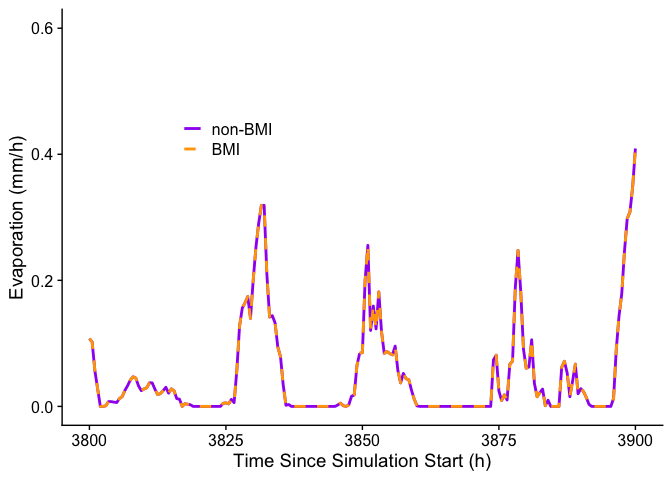
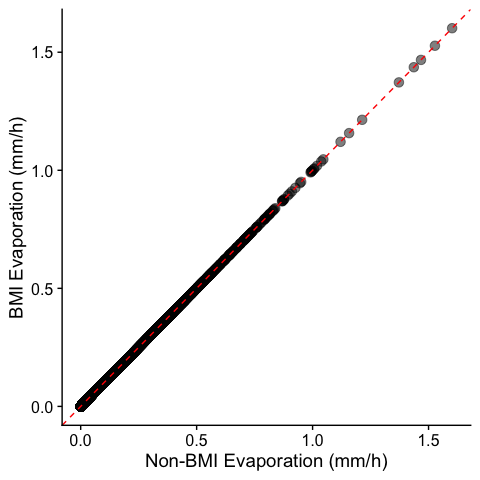
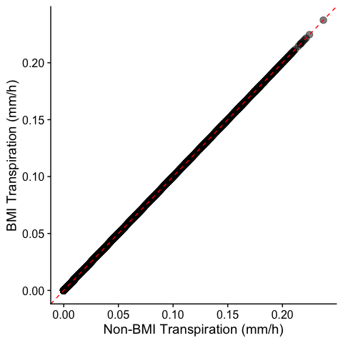

BMI vs. non-BMI Model Output Comparison
================
Keith Jennings
9/23/2021

# Introduction

The `analysis` directory includes R code to compare model output from
two surface routines of Noah-MP-Modular: one with a Basic Model
Interface (BMI) implementation and one without.

BMI should have no effect on model output as it is a type of middleware
that leaves the source code of hydrologic models untouched. Therefore,
we expect model output to be identical.

# Methods

## Build the models

Change into the directory for each model version to build the
executable. (Note: R Markdown assumes the working directory is the
file’s host directory and needs to be switched for the code chunks.)

``` r
# Build /surface
setwd("../../../surface/")
system("make clean") # in case a build already exists
system("make")

# Build /surface_bmi
setwd("../surface_bmi")
system("make clean") # in case a build already exists
system("make")
```

## Run the models

``` r
# Run /surface
setwd("../../../surface/run")
system("./noahmp_refac.exe")

# Run /surface_bmi
setwd("../../surface_bmi/run")
system("./noahmp_refac.exe namelist.input")
```

## Import the output into R

First load the packages we’ll need for the analysis:

``` r
library(tidyverse)
library(cowplot); theme_set(theme_cowplot())
library(ncdf4)
```

Next, get the output files into R:

``` r
# non-BMI output
tmp_nc <- nc_open("../../../surface/run/output.nc")
df_non <- data.frame(water_flux_surface = ncvar_get(tmp_nc, "waterin_sfc"),
                     evaporation        = ncvar_get(tmp_nc, "evaporation"),
                     transpiration      = ncvar_get(tmp_nc, "transpiration")) %>% 
  mutate(sim_hours = seq(from = 0.5, length.out = n(), by = 0.5),
         mode      = "non") %>% 
  # mutate vars to be mm/h
  mutate(water_flux_surface = water_flux_surface / 1800 * 3600,
         evaporation        = evaporation / 1800 * 3600,
         transpiration      = transpiration / 1800 * 3600)

# BMI output
tmp_nc <- nc_open("../../../surface_bmi/data/output.nc")
df_bmi <- data.frame(water_flux_surface = ncvar_get(tmp_nc, "waterin_sfc"),
                     evaporation        = ncvar_get(tmp_nc, "evaporation"),
                     transpiration      = ncvar_get(tmp_nc, "transpiration")) %>% 
  mutate(sim_hours = seq(from = 0.5, length.out = n(), by = 0.5),
         mode      = "bmi") %>% 
  # mutate vars to be mm/h
  mutate(water_flux_surface = water_flux_surface / 1800 * 3600,
         evaporation        = evaporation / 1800 * 3600,
         transpiration      = transpiration / 1800 * 3600)

# Bind for plotting time series
df_bind <- bind_rows(df_non, df_bmi) %>% 
  mutate(mode = factor(mode, levels = c("non", "bmi")))

# Join for plotting comparison
df_join <- left_join(dplyr::select(df_non, -mode),
                     dplyr::select(df_bmi, -mode),
                     by = "sim_hours", 
                     suffix = c("_non", "_bmi"))
```

# Results

## Time series

The following plots show time series examples of non-BMI and BMI output
for:

### Liquid water flux to the land surface

<!-- -->

### Evaporation

<!-- -->

### Transpiration

<!-- -->

## 1:1 comparisons

Examining model results for the BMI output variables QINSUR (surface
liquid water flux), QSEVA (evaporation), and ETRAN (transpiration), we
find no difference between the non-BMI and BMI version of
Noah-MP-Modular.

QINSUR has a mean difference of 0 and a maximum difference of 0.

QSEVA has a mean difference of 0 and a maximum difference of 0.

ETRAN has a mean difference of 0 and a maximum difference of 0.

The following plots show the 1:1 match between non-BMI and BMI output
for:

### Liquid water flux to the land surface

<!-- -->

### Evaporation

<!-- -->

### Transpiration

<!-- -->
